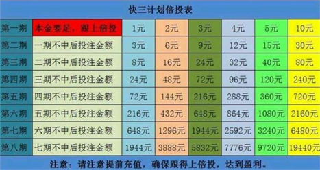
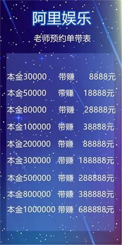
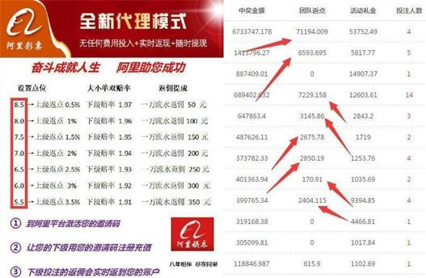

读取程序包

```{r include=FALSE}
## 3210448065@qq.com
## leiou123

## 2849108450@qq.com
## leiou123
## https://rstudio.cloud/project/1198888

require('plyr')
require('dplyr')
require('magrittr')
require('stringr')
require('knitr')
require('kableExtra')
require('lubridate')
require('broom')
require('purrr')
require('tibble')
require('DT')
```

# 数据

## 样本数据

账号：`zxg00123`，以下是从我们平台购彩助手中的官方数据采集下来的数据，什么彩种都可以分析，就拿个主打**1分快3**为样本。


```{r warning=FALSE}
hml <- read.delim(file = '1分快3样本数据2.txt')
hml %<>% unlist %>% as.character

#时间 期数 号码 大小/单双 鱼虾蟹
#12:41 0761 dice1 dice1 dice57 小 单 鱼 鱼 蟹
smp <- c('12:41', '0761', 'dice1 dice1 dice5', '7 小 单', '鱼 鱼 蟹') %>% matrix(nc = 1, byrow = TRUE) %>% t %>% data.frame
nm <- c('时间', '期数', '号码', '大小/单双', '鱼虾蟹')
names(smp) <- nm
smp %<>% tbl_df

smp %>% 
  kable(caption = '1分快3样本数据') %>% 
  kable_styling(bootstrap_options = c('striped', 'hover', 'condensed', 'responsive'))
```

以上是原始样本数据结构。

## 整理数据

```{r warning=FALSE}
smpp <- hml %>% llply(., function(x) {
    x %>% str_extract_all('([0-9]{2}:[0-9]{2})|([0-9]{1,2}%)|(\\w+)') %>% unlist %>% str_replace_all('2e1d3b04', '') %>% str_replace_all('([0-9]+[a-zA-Z]+)|([a-zA-Z]+)|[0-9]{1,2}%', '') %>% .[nchar(.)>0] %>% t %>% data.frame
}) %>% bind_rows %>% tbl_df
names(smpp) <- c('时间', '期数', '骰子1', '骰子2', '骰子3', '总值', '大小', '单双', '鱼虾蟹1', '鱼虾蟹2', '鱼虾蟹3')

smpp %<>% mutate(
    `时间` = hm(`时间`), `期数` = factor(`期数`), 
    `骰子1` = as.numeric(`骰子1`), `骰子2` = as.numeric(`骰子2`), 
    `骰子3` = as.numeric(`骰子3`), `总值` = as.numeric(`总值`), 
    `大小` = factor(`大小`), `单双` = factor(`单双`), 
    `鱼虾蟹1` = factor(`鱼虾蟹1`), `鱼虾蟹2` = factor(`鱼虾蟹2`), 
    `鱼虾蟹3` = factor(`鱼虾蟹3`))

smppp <- smpp[c('总值', '大小', '单双')]

smpp %>% datatable(
    caption = "1分快3样本数据", 
    escape = FALSE, filter = 'top', rownames = FALSE, 
    extensions = list('ColReorder' = NULL, 'RowReorder' = NULL, 
                      'Buttons' = NULL, 'Responsive' = NULL), 
    options = list(dom = 'BRrltpi', autoWidth = TRUE,  scrollX = TRUE, 
                   lengthMenu = list(c(10, 50, 100, -1), c('10', '50', '100', 'All')), 
                   ColReorder = TRUE, rowReorder = TRUE, 
                   buttons = list('copy', 'print', 
                                  list(extend = 'collection', 
                                       buttons = c('csv', 'excel', 'pdf'), 
                                       text = 'Download'), I('colvis'))))
```

以上是整理过的样本数据。

# 统计模型

## 基本分析

```{r}
smpp[-c(1:2)] %>% llply(table)
```

```{r warning=FALSE}
yy <- suppressMessages(llply(3:18, function(i) {
  dpois(i, smppp$总值) %>% round(2)
}) %>% bind_cols)
names(yy) <- paste0('X', 3:18)
yy <- data.frame(smppp, yy) %>% tbl_df

yy %>% 
  kable(caption = '和值概率明细') %>% 
  kable_styling(bootstrap_options = c('striped', 'hover', 'condensed', 'responsive')) %>% 
  scroll_box(width = '100%', height = '400px')
```

以上图表显示骰子总值从`3`到`18`的概率明细。

```{r}
table(smpp$`总值`)
prop.table(table(smpp$`总值`))
barplot(prop.table(table(smpp$`总值`)))
```

以上图表显示骰子总值从`3`到`18`的概率。

```{r}
table(smpp$`大小`)
prop.table(table(smpp$`大小`))
barplot(prop.table(table(smpp$`大小`)))
```

以上图表显示骰子总值开`大`或`小`的概率。

```{r}
table(smpp$`单双`)
prop.table(table(smpp$`单双`))
barplot(prop.table(table(smpp$`单双`)))
```

以上图表显示骰子总值开`单`或`双`的概率。

```{r}
table(smpp$`鱼虾蟹1`)
prop.table(table(smpp$`鱼虾蟹1`))
barplot(prop.table(table(smpp$`鱼虾蟹1`)))
```

以上图表显示骰子总值开`葫`、`虾`、`蟹`、`钱`、`鱼`或`鸡`的概率。

```{r}
table(smpp$`鱼虾蟹2`)
prop.table(table(smpp$`鱼虾蟹2`))
barplot(prop.table(table(smpp$`鱼虾蟹2`)))
```

以上图表显示骰子总值开`葫`、`虾`、`蟹`、`钱`、`鱼`或`鸡`的概率。

```{r}
table(smpp$`鱼虾蟹3`)
prop.table(table(smpp$`鱼虾蟹3`))
barplot(prop.table(table(smpp$`鱼虾蟹3`)))
```

以上图表显示骰子总值开`葫`、`虾`、`蟹`、`钱`、`鱼`或`鸡`的概率。

## 统计建模

以下是以广义型泊松模型预测开奖率。

```{r eval=FALSE}
### 计算总值概率

## https://stats.stackexchange.com/questions/272194/interpreting-poisson-output-in-r
md1a <- glm(`总值`~`骰子1`+`骰子2`+`骰子3`, data = smpp, family = poisson)

md1b <- glm(`总值`~`骰子1`+`骰子2`+`骰子3` - 1, data = smpp, family = poisson)

ldply(list(md1a, md1b), AIC) %>% 
    data.frame(`模型·` = c('截距', '没截距'), .) %>% 
    rename(aic = V1) %>% 
  kable(caption = '统计模型') %>% 
  kable_styling(bootstrap_options = c('striped', 'hover', 'condensed', 'responsive'))


根据以上模型，`截距`模型比较精准。


md1a.pp <- md1a %>% coef %>% 
    exp %>% 
    llply(., function(x) {dpois(3:18, x)}) %>% 
    bind_cols %>% 
    data.frame(x = 3:18, .)
names(md1a.pp) <- c('x', '截距', '骰子1', '骰子2', '骰子3')
md1a.pp %>% 
  kable(caption = '统计模型') %>% 
  kable_styling(bootstrap_options = c('striped', 'hover', 'condensed', 'responsive'))


### 计算大小概率


md2a <- glm(as.numeric(`大小`)~`骰子1`+`骰子2`+`骰子3`, data = smpp, family = poisson)

md2b <- glm(as.numeric(`大小`)~`骰子1`+`骰子2`+`骰子3` - 1, data = smpp, family = poisson)

ldply(list(md2a, md2b), AIC) %>% 
    data.frame(`模型·` = c('截距', '没截距'), .) %>% 
    rename(aic = V1) %>% 
  kable(caption = '统计模型') %>% 
  kable_styling(bootstrap_options = c('striped', 'hover', 'condensed', 'responsive'))


根据以上模型，`截距`模型比较精准。


md2a.pp <- md2a %>% coef %>% 
    exp %>% 
    llply(., function(x) {dpois(1:18, x)}) %>% 
    bind_cols %>% 
    data.frame(x = 1:18, .)
names(md1a.pp) <- c('x', '截距', '骰子1', '骰子2', '骰子3')
md1a.pp %>% 
  kable(caption = '统计模型') %>% 
  kable_styling(bootstrap_options = c('striped', 'hover', 'condensed', 'responsive'))


### 计算单双概率


md3a <- glm(as.numeric(`单双`)~`骰子1`+`骰子2`+`骰子3`, data = smpp, family = poisson)

md3b <- glm(as.numeric(`单双`)~`骰子1`+`骰子2`+`骰子3` - 1, data = smpp, family = poisson)

ldply(list(md3a, md3b), AIC) %>% 
    data.frame(`模型·` = c('截距', '没截距'), .) %>% 
    rename(aic = V1) %>% 
  kable(caption = '统计模型') %>% 
  kable_styling(bootstrap_options = c('striped', 'hover', 'condensed', 'responsive'))


根据以上模型，`截距`模型比较精准。


md3a.pp <- md3a %>% coef %>% 
    exp %>% 
    llply(., function(x) {dpois(1:6, x)}) %>% 
    bind_cols %>% 
    data.frame(x = 1:6, .)
names(md1a.pp) <- c('x', '截距', '骰子1', '骰子2', '骰子3')
md1a.pp %>% 
  kable(caption = '统计模型') %>% 
  kable_styling(bootstrap_options = c('striped', 'hover', 'condensed', 'responsive'))
```

```{r, eval=FALSE}
## formula for modeling of lambda1 and lambda2
#form1 <- ~c(team1,team2)+c(team2,team1)

## Model 1: Double Poisson
#ex4.m1<-lm.bp( g1~1, g2~1, l1l2=form1, zeroL3=TRUE, data=ex4.ita91)

## Models 2-5: bivariate Poisson models
#ex4.m2<-lm.bp(g1~1,g2~1, l1l2=form1, data=ex4.ita91, maxit=2)
#ex4.m3<-lm.bp(g1~1,g2~1, l1l2=form1, l3=~team1, data=ex4.ita91, maxit=2)
#ex4.m4<-lm.bp(g1~1,g2~1, l1l2=form1, l3=~team2, data=ex4.ita91, maxit=2)
#ex4.m5<-lm.bp(g1~1,g2~1, l1l2=form1, l3=~team1+team2, data=ex4.ita91, maxit=2)

form1 <- ~c('大小', '单双') + c('单双', '大小')
l1 = 总值~1; l2 = 总值~2; l1l2 = NULL; l3 = ~1; data = smppp; common.intercept = FALSE; zeroL3 = FALSE; maxit = 100; pres = 1e-8; verbose = getOption('verbose')

lm.bp(大小 ~ 1, 单双 ~ 2, l1l2 = form1, zeroL3 = TRUE, data = smpp)
lm.bp(大小 ~ 1, 单双 ~ 2, l1l2 = form1, data = smpp, maxit = 2)
lm.bp(大小 ~ 1, 单双 ~ 2, l1l2 = form1, l3 = ~单双, data = smpp, maxit = 2)
lm.bp(大小 ~ 1, 单双 ~ 2, l1l2 = form1, l3=~大小+单双, data = smpp, maxit = 2)
```

### 计算大小单双概率

#### 760期

```{r}
dx = glm(as.numeric(大小)~总值-1, family=poisson, data=smppp) %>% 
    coef %>% exp
dx <- dx/sum(1 + dx)
ds = glm(as.numeric(单双)~总值-1, family=poisson, data=smppp) %>% 
    coef %>% exp
ds <- ds/sum(1 + ds)
n760 <- data.frame(dx, ds) %>% 
    rename(`开大` = dx, `开单` = ds) %>% 
    mutate(`开小` = 1- `开大`, `开双` = 1- `开单`) %>% 
    select('开大', '开小', '开单', '开双')

n760[c('开大', '开小', '开单', '开双')] %>% 
  colMeans %>% t %>% 
  kable(caption = '760期为标准') %>% 
  kable_styling(bootstrap_options = c('striped', 'hover', 'condensed', 'responsive'))
```

#### 20期

```{r}
##20期为标准
n20 <- llply(21:nrow(smppp), function(i) {
  ii <- i - 20
  dx = glm(as.numeric(大小)~总值-1, family=poisson, data=smppp[c(ii:i),]) %>% 
    coef %>% exp
  dx <- dx/sum(1 + dx)
  ds = glm(as.numeric(单双)~总值-1, family=poisson, data=smppp[c(ii:i),]) %>% 
    coef %>% exp
  ds <- ds/sum(1 + ds)
  data.frame(dx, ds) %>% 
    rename(`开大` = dx, `开单` = ds) %>% 
    mutate(`开小` = 1- `开大`, `开双` = 1- `开单`) %>% 
    select('开大', '开小', '开单', '开双') %>% 
    data.frame(smppp[i,], .)
}) %>% bind_rows %>% tbl_df

n20 %>% 
  kable(caption = '20期为标准') %>% 
  kable_styling(bootstrap_options = c('striped', 'hover', 'condensed', 'responsive')) %>% 
  scroll_box(width = '100%', height = '400px')
```

以上的数据以`20`期移动数据为标准，然后预测第`21`期移动数据的开奖率。

```{r}
n20[c('开大', '开小', '开单', '开双')] %>% 
  colMeans %>% t %>% 
  kable(caption = '20期为标准') %>% 
  kable_styling(bootstrap_options = c('striped', 'hover', 'condensed', 'responsive'))
```

以上乃`20`期总体开奖该率。

#### 30期

```{r}
##30期为标准
n30 <- llply(31:nrow(smppp), function(i) {
  ii <- i - 30
  dx = glm(as.numeric(大小)~总值-1, family=poisson, data=smppp[c(ii:i),]) %>% 
    coef %>% exp
  dx <- dx/sum(1 + dx)
  ds = glm(as.numeric(单双)~总值-1, family=poisson, data=smppp[c(ii:i),]) %>% 
    coef %>% exp
  ds <- ds/sum(1 + ds)
  data.frame(dx, ds) %>% 
    rename(`开大` = dx, `开单` = ds) %>% 
    mutate(`开小` = 1- `开大`, `开双` = 1- `开单`) %>% 
    select('开大', '开小', '开单', '开双') %>% 
    data.frame(smppp[i,], .)
}) %>% bind_rows %>% tbl_df

n30 %>% 
  kable(caption = '20期为标准') %>% 
  kable_styling(bootstrap_options = c('striped', 'hover', 'condensed', 'responsive')) %>% 
  scroll_box(width = '100%', height = '400px')
```

以上的数据以`30`期移动数据为标准，然后预测第`31`期移动数据的开奖率。

```{r}
n30[c('开大', '开小', '开单', '开双')] %>% 
  colMeans %>% t %>% 
  kable(caption = '30期为标准') %>% 
  kable_styling(bootstrap_options = c('striped', 'hover', 'condensed', 'responsive'))
```

以上乃`30`期总体开奖该率。

#### 40期

```{r}
##40期为标准
n40 <- llply(41:nrow(smppp), function(i) {
  ii <- i - 40
  dx = glm(as.numeric(大小)~总值-1, family=poisson, data=smppp[c(ii:i),]) %>% 
    coef %>% exp
  dx <- dx/sum(1 + dx)
  ds = glm(as.numeric(单双)~总值-1, family=poisson, data=smppp[c(ii:i),]) %>% 
    coef %>% exp
  ds <- ds/sum(1 + ds)
  data.frame(dx, ds) %>% 
    rename(`开大` = dx, `开单` = ds) %>% 
    mutate(`开小` = 1- `开大`, `开双` = 1- `开单`) %>% 
    select('开大', '开小', '开单', '开双') %>% 
    data.frame(smppp[i,], .)
}) %>% bind_rows %>% tbl_df

n40 %>% 
  kable(caption = '40期为标准') %>% 
  kable_styling(bootstrap_options = c('striped', 'hover', 'condensed', 'responsive')) %>% 
  scroll_box(width = '100%', height = '400px')
```

以上的数据以`40`期移动数据为标准，然后预测第`41`期移动数据的开奖率。

```{r}
n40[c('开大', '开小', '开单', '开双')] %>% 
  colMeans %>% t %>% 
  kable(caption = '40期为标准') %>% 
  kable_styling(bootstrap_options = c('striped', 'hover', 'condensed', 'responsive'))
```

以上乃`40`期总体开奖该率。

#### 50期

```{r}
##50期为标准
n50 <- llply(51:nrow(smppp), function(i) {
  ii <- i - 50
  dx = glm(as.numeric(大小)~总值-1, family=poisson, data=smppp[c(ii:i),]) %>% 
    coef %>% exp
  dx <- dx/sum(1 + dx)
  ds = glm(as.numeric(单双)~总值-1, family=poisson, data=smppp[c(ii:i),]) %>% 
    coef %>% exp
  ds <- ds/sum(1 + ds)
  data.frame(dx, ds) %>% 
    rename(`开大` = dx, `开单` = ds) %>% 
    mutate(`开小` = 1- `开大`, `开双` = 1- `开单`) %>% 
    select('开大', '开小', '开单', '开双') %>% 
    data.frame(smppp[i,], .)
}) %>% bind_rows %>% tbl_df

n20 %>% 
  kable(caption = '50期为标准') %>% 
  kable_styling(bootstrap_options = c('striped', 'hover', 'condensed', 'responsive')) %>% 
  scroll_box(width = '100%', height = '400px')
```

以上的数以`50`期移动数据为标准，然后预测第`51`期移动数据的开奖率。

```{r}
n50[c('开大', '开小', '开单', '开双')] %>% 
  colMeans %>% t %>% 
  kable(caption = '50期为标准') %>% 
  kable_styling(bootstrap_options = c('striped', 'hover', 'condensed', 'responsive'))
```

以上乃`50`期总体开奖该率。

### 模型比较

```{r}
md <- list(n760 = n760, 
     n20 = n20[c('开大', '开小', '开单', '开双')] %>% colMeans, 
     n30 = n30[c('开大', '开小', '开单', '开双')] %>% colMeans, 
     n40 = n40[c('开大', '开小', '开单', '开双')] %>% colMeans, 
     n50 = n50[c('开大', '开小', '开单', '开双')] %>% colMeans) %>% bind_rows
md <- data.frame(.id = c('n760', 'n20', 'n30', 'n40', 'n50'), md) %>% tbl_df

md %>% 
  kable(caption = '模型比较') %>% 
  kable_styling(bootstrap_options = c('striped', 'hover', 'condensed', 'responsive'))
```

以上的样本数据显示，`20`期、`30`期、`40`期和`50`期为一个移动数据预测下一期开奖率，结果都是相差不大。

## 盈利模式

### 套彩

**赔率与优惠**

以平台欧赔`1.98`来说，亚赔`0.98`等于`r 1/0.98`，会员平均投`r 1/0.98`元才能赢1元。

- 以开大概率`0.506`来说，开大的优势为`r 0.506/0.5`，会员将会亏`r 0.506/0.5 - 1/0.98`，不过以我们平台的优惠活动彩金送得多，还是可以赢钱的呢。
- 以开单概率`0.508`来说，开单的优势为`r 0.508/5`，会员将会亏`r 0.508/0.5 - 1/0.98`，不过以我们平台的优惠活动彩金送得多，还是可以赢钱的呢。

我们平台最新活动彩金介绍：

  1) 周一到周五转账彩金2%送，次日自动到账。
  2) 周六，周日转账彩金3%送，当天未下注前找在线客服领取。
  3) 每日嘉奖零点后自己手动领取，在平台的活动中心每日嘉奖里面领取。
  4) 晋级奖励最高58888 在平台活动中心晋级奖励里面领取。
  5) 官方授权聊天室福利来袭  红包每天100万 整点发放领取最高1888。
  6) 余额宝活期理财，每1万本金存入余额宝转出余额可以直接领取1000彩金。
  7) 签到满勤奖，只要一星期内满足存款条件，星期一即可领取最高5888元奖励
  
提醒：每笔充值金额达到200元以上，方可领取转卡加赠彩金（不限笔数）

以上优惠与赔率开奖数据，可以证明是可以套彩的呢。

### 投注模式

**必胜攻略，真实稳赚**
你一定行，你一定赢

#### 秘诀1：增倍方式

以10起押为例,10,20,40,80,160,320,640依次下去，反正一把就要把前面输的赢回来，准备最少6期本金。当然也要视自己的情况押，比如5,10,20,40 起押，倍增多少自己可以算。



有兴趣索取个倍投表电子表格，加菜菜QQ：2849108450

#### 秘诀2：押注方式

进行游戏后谁赢就押谁。大赢了，就押大。 如果小赢了，那就跟着押小;然后就一直交替着押，这样押的目的是避免出10连，甚至20连亏。

#### 秘诀3：走势规律

口诀中的一见跳跟跳;不管什么时候玩，我们都要学会观察走势规律，即大小大小大小;这样单跳的情况，一旦出现时，我们就要顺势而为出大买小，前面的方法我们都先不要管，一直到不再单跳为止。


#### 秘诀4：雪球方式

每日最多充50次200元最多亏1万元，每次2百元梭哈7次赢到12800才提款，过一个6次梭哈就抵消64次亏200元的本金，依概率来说很划算。一天试50次，只要过一次就能赢几千元。即使第50次才过也能赚2800元，难道试50次，就连过一个7次梭哈都不可能吗？

最简单最实用的方法，需要听老师详细讲解。

### 线下活动

#### 大额彩金


彩金送得多，名额有限，相信其它平台都没有呢。

#### 包赔活动

亏得多的会员可以报名预约带亏了包赔，名额有限，相信其它平台都没有呢。

#### 带赚活动



无论盈亏的会员，亏得多的会员更需要报名预约赢回钱，名额有限，相信其它平台都没有呢。

### 当代理



以上图表显示当代理可以挣钱的呢。比方说介绍3个朋友当下级，返点设置为`8.5`的话，各别充5千打1万5千打码量的话，就有4万5千打码量，3人 x 4.5打码量 x 50返点 = `r 3*4.5*50`。假如1天挣`r 3*4.5*50`，一个月就能挣`r 3*4.5*50*30`了。


以上乃激活邀请码的教程。

当代理挣返点也是适合打工一族业余兼职、宝妈、学生，尤其是生意人人脉广阔，挣钱方便生意周转。

# 结论

## 总结

以上总结，会员可以到我们平台通过不同盈利模式挣钱的呢。

```{r eval=FALSE}

## 改进

## https://stackoverflow.com/a/45344291
require('RSelenium')
require('rvest')
#require('wdman')
#require('webshot')
require('decryptr')

## 网址
## 登录网址
lnk <- 'https://m.a80802.com:8760/login'
## 彩种一栏
lnkcz <- 'https://m.cjezllpcecbm.com/allLottery/?source=lottery'
## 1分快三
lnk1k3 <- 'https://m.cjezllpcecbm.com/history/K3/OG1K3/?source=lottery'
## 3分快三
lnk3k3 <- 'https://m.cjezllpcecbm.com/history/K3/OG3K3/?source=lottery'

#lnk1k3 %>% 
#  read_html %>% 
#  html_nodes(xpath = '//*[@id="scrollContainer"]/div[2]') %>% 
#  html_table()

## 打开隐藏浏览器
pDrv <- phantomjs(port = 4567L, check = FALSE, verbose = FALSE)
remDr <- remoteDriver(browserName = 'phantomjs', port = 4567L)
remDr$open(silent = TRUE)

## 浏览网站
remDr$navigate(lnk1k3)

## 输入账号
webElem <- remDr$findElement(using = 'xpath', value = '//*[@id="app"]/div/div[1]/div[3]/div/table/tbody/tr[1]/td[2]/input')
webElem$clickElement()
webElem$sendKeysToElement(list('leiou004', key = 'enter'))

## 输入密码
webElem <- remDr$findElement(using = 'xpath', value = '//*[@id="app"]/div/div[1]/div[3]/div/table/tbody/tr[2]/td[2]/input')
webElem$clickElement()
webElem$sendKeysToElement(list('leiou123', key = 'enter'))

## 验证码
## https://github.com/decryptr/decryptr
## https://rpubs.com/johndharrison/14707
webElem <- remDr$findElement(using = 'xpath', value = '//*[@id="geetest"]/div/div[2]/div[1]/div[3]')
webElem$clickElement()
webElem$sendKeysToElement(list(key = 'enter'))
#webElem$switchToFrame('div.geetest_popup_box')

#if (!require(devtools)) install.packages('devtools')
#devtools::install_github('decryptr/decryptr')


##样本数据只是减低投资风险，采集实时数据才能证实有效性。


```

## 附录

```{r info, echo=FALSE, warning=FALSE, results='asis'}
suppressMessages(require('dplyr', quietly = TRUE))
suppressMessages(require('formattable', quietly = TRUE))
suppressMessages(require('knitr', quietly = TRUE))
suppressMessages(require('kableExtra', quietly = TRUE))
sys1 <- devtools::session_info()$platform %>% 
  unlist %>% data.frame(Category = names(.), session_info = .)
rownames(sys1) <- NULL
#sys1 %<>% rbind(., data.frame(
#  Category = 'Current time', 
#  session_info = paste(as.character(lubridate::now('Asia/Tokyo')), 'JST'))) %>% 
#  dplyr::filter(Category != 'os')
sys2 <- data.frame(Sys.info()) %>% mutate(Category = rownames(.)) %>% .[2:1]
names(sys2)[2] <- c('Sys.info')
rownames(sys2) <- NULL
if (nrow(sys1) == 7 & nrow(sys2) == 8) {
  sys1 %<>% rbind(., data.frame(
  Category = 'Current time', 
  session_info = paste(as.character(lubridate::now('Asia/Tokyo')), 'JST')))
} else {
  sys2 %<>% rbind(., data.frame(
  Category = 'Current time', 
  Sys.info = paste(as.character(lubridate::now('Asia/Tokyo')), 'JST')))
}
cbind(sys1, sys2) %>% 
  kable(caption = 'Additional session information:') %>% 
  kable_styling(bootstrap_options = c('striped', 'hover', 'condensed', 'responsive'))
rm(sys1, sys2)
```
